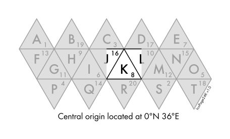
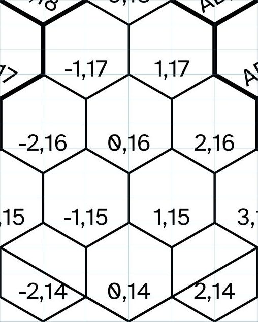
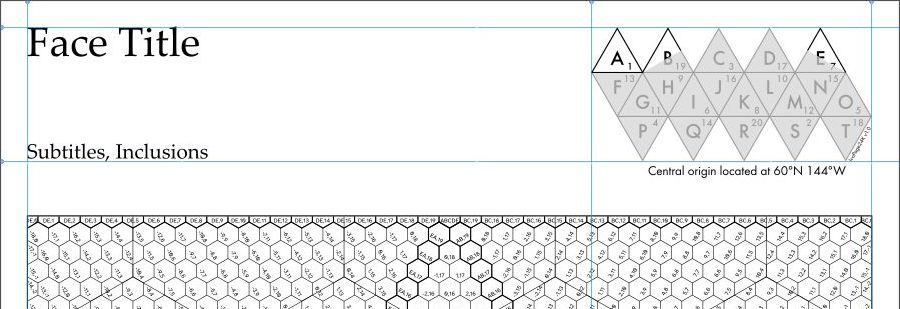

# IcoPage24K

## Global gaming grid


**For entertainment purposes only**

This is a set of `svg` files, each encompassing one face of an icosahedral
(20-sided) projection of a globe. Halves of the two faces to the east and west
are also shown on each page to place the triangular face within a rectangular
space. That space is then divided with a hexagonal grid.

Each `svg` is sized to fit one US Letter page. They are intended as map
templates—"graph paper"—with which one may draw the terrain depicted, either
directly in a vector-drawing application such as
[Inkscape](https://inkscape.org/) or by exporting the layers into a
raster-drawing app like [GIMP](https://www.gimp.org/).

This is **not** a mathematically rigorous projection of a world that actually
exists. Rather, it is a framework in which role-playing game campaign maps may
be arranged into a coherent world. It is an aid to conceptualizing the space so
that, as game characters march toward a pole, the GM may gain some insight into
when they should put on sweaters. It can also pin down the milieus of co-GMs
relative to each other.

Scales are provided that size the world to roughly that of Earth, with a
circumference at the equator of 24,000 miles. This makes the small hexes of the
grid 120 miles across. The measures of the other hex dimensions—point-to-point
and along a side—are given as well. An alternate scale is provided that equates
120 miles to 44 leagues; this has old-school D&D movement rates in mind so that
1 league equals 4,800 yards (480").

[**Coming Soon**] From there, HexPages are given to depict a 120-mile hexagon,
and others can show magnifications of smaller sub-hex areas. Obviously, not
every numbered hex can be provided here, and tastes vary on just which
magnification steps are desired. However, these pages are much easier to copy
and alter as needed since only the numbers in the hex key in the upper right
need to be changed.

Some rudimentary Python scripts for producing grids are present as well.

## Contents

* [Requirements](#requirements)
  * [Optional resources](#optional-resources)
* [Features](#features)
  * [Titles](#titles)
  * [Globe diagram](#globe-diagram)
  * [Grids](#grids)
    * [Hex numbers](#hex-numbers)
    * [Main grid](#main-grid)
    * [Middle grid](#middle-grid)
    * [Face edges](#face-edges)
  * [Scales](#scales)
  * [Compass roses](#compass-roses)
  * [Free space](#free-space)
* [HexPages](#hexpages)
* [Using IcoPage24K](#using-icopage24k)
  * [Layers](#layers)
  * [Drawing grid and guides](#drawing-grid-and-guides)
  * [Style classes](#style-classes)
  * [Clip paths](#clip-paths)
* [Appendices](#appendices)
  * [Scale computations](#scale-computations)
  * [Fractions](#fractions)
    * [Font considerations](#font-considerations)
    * [Glyphs](#glyphs)
    * [OTF fractions](#otf-fractions)
    * [Other OTF features](#other-otf-features)
  * [Python scripts](#python-scripts)
  * [Example of using mkhexgrid_wrapper.py](#example-of-using-mkhexgrid_wrapperpy)

## Requirements

Some other resources are needed in order to use these files.

* A vector-drawing application like Inkscape, mentioned above. Inkscape versions
  1.2.2 and 1.3 were used to produce these files (with further refinements in a
  text editor).
* Fonts: The fonts used in each file must be installed in the user's computer in
  order to be displayed correctly. Some fallback font names are given in the
  [style classes](#style-classes), but the pages' appearance may look
  unexpectedly bad if the first choices are not present.
  * [Atkinson Hyperlegible](https://brailleinstitute.org/freefont) is used for
    the hex coordinates and is freely available. It was selected because it does
    a good job of making zero distinct from the letter "O", and it is **not**
    monospaced so that the comma in a Cartesian coordinate pair doesn't take too
    much room.
  * Other fonts are discussed under the [optional
    resources](#optional-resources) below.

### Optional resources

In addition to the above, these supplemental resources can be of great
assistance in using these files.

* More fonts
  * [URW++ Futura](https://www.myfonts.com/collections/futura-font-urw) is not
    free, but it is one that was used in the globe diagram, scale, and related
    texts. Specifically, the Book and Medium weights are present. One has many
    options for acquiring this or another version of Futura, if desired.
  * Jost* ([google fonts](https://fonts.google.com/specimen/Jost),
    [indestructable type*](https://indestructibletype.com/Jost.html)): This is a
    decent substitute for Futura, and an alternate set of pages was done making
    that substitution. It is available free from Google Fonts or enhanced and
    modestly priced from the foundry's site. One of its [stylistic
    sets](https://fonts.google.com/knowledge/glossary/stylistic_sets), `ss01`,
    was invoked in order to use the single-story lowercase "a".
  * Palatino Linotype: This is the version that is present on a Windows computer
    that has seen operating systems since Win98 and Office installations since
    then as well. Perhaps you already have it too. If not, that's the font used
    in the page title and subtitles, and one may want a whole different look for
    that anyway.
* Inkscape extensions
  * [Batch export](https://github.com/StefanTraistaru/batch-export) makes it
    easy to export the layers individually. **At the time of this writing, this
    does not yet work with Inkscape version 1.3 but does with version 1.2.2.**
    This is useful if one wants to convert each layer to a `png` and build a map
    in GIMP with artwork generated there.
  * Hex grid generation: there have been an extension or two that do this
    through the years. Those extensions were generally written for older
    versions of Inkscape and might not work with the current one, but it has
    been a while since any were tried. For these pages, we used a different
    program with which we've long been familiar.
* mkhexgrid ([download](https://www.nomic.net/~uckelman/mkhexgrid/),
  [source](https://github.com/search?q=mkhexgrid&type=repositories)) This
  command-line program was used to produce the hex grids and coordinates, though
  the latter were subsequently processed to insert negative numbers. This, or
  something like it, is only necessary if one wants different grids than those
  provided. It can be used in many ways, and the Python wrapper and
  grid-generation script used to make these pages are included.
* [Python](https://www.python.org/) Some [Python scripts](#python-scripts) have
  been provided to produce additional grids using `mkhexgrid.exe`. One can use
  that program without Python, of course, and one may not even need any more
  grids in the first place.

## Features

The features of the IcoPages are described below. The HexPages that serve to
magnify smaller areas share some of these features but are described in their
own right in [HexPages](#hexpages) below.

### Titles

The upper left corner holds the main title of the globe face, and placeholder
text has been inserted.

Another textbox holds subtitles; these can be envisioned as a list of the large
areas present: seas, subcontinents, large nations, anything on a fairly grand
scale.

Of course, one can put something else here too. Perhaps a co-GM running a
campaign here waxes dramatic in the "In a world…" vein on the character of the
milieu presented.

One could even remove the text entirely and draw lines suitable for filling in
by hand, if one would like to print these out empty and draw on them the
old-fashioned way.

### Globe diagram



_Face K, Futura_


_Face P, Jost*_

In the upper right of each page, a diagram of the icosahedral globe projection
is presented in flattened form. Most of it is gray with darker gray text and
borders. A portion of each is highlighted in black and white to indicate the
area presented on a given page.

Each triangular face is lettered in order from left to right and from the top
downward. A–E are in the northern 60° of latitude, F–O are centered on the
equator, and P–T are in the south.

Each face also has a number beside the letter. These are taken from a
twenty-sided die (d20), since this is for gaming and we have ready models of the
world at hand. Face A has been assigned the number 1, and the rest are arranged
as the die is numbered with 1 pointed upward. Well, perhaps die-numbering
patterns vary from different manufacturers, but all the ones available in our
bag looked like this. There isn't any grand reason for these, but they could
come in handy if the GM wishes to smite the world with a comet or a _teleport_
spell goes very, very badly.

Below, the latitude and longitude of the face's origin hex are given. This is
specified as "Central" since the adjacent faces' origins also appear, in whole
or half. Each map extends to 30° latitude above and below that value. Longitude
is more variable, with polar faces changing twice as much as adjacent equatorial
ones.

No effort has been made to radiate and narrow longitude more finely than by face
and edge, as is described in [grids](#grids) below. Indeed, we are no more
mathematicians than graphic designers, and suspicion has crept in that maybe the
equator shouldn't be where it has been placed here at all, but perhaps it ought
to wave up and down through each triangle's true center. However, this is a
game, projections of globes onto flat maps necessarily introduce distortions and
errors, etc. This may send the topologist among the players over to the corner
where the geologist has been muttering ever since the GM put dripping
stalactites under a volcano, but, as a wise sage once said:

>Wave your hands in the air  
>Wave 'em like you just don't care

### Grids


_Page center_

The most prominent element of each page is, of course, the grid where the map
goes. There are four basic layouts: northern, downward-pointing equatorial,
upward-pointing equatorial, and southern. Aside from the coordinates of the edge
hexes, the rest of the hex numbers are the same on each face of each layout.

In the `svg`, each grid is given its own [layer](#layers), which may be made
visible or hidden as needed. The hex numbers are on layers of their own as well.

#### Hex numbers

Hex numbers (coordinates, labels, the terms are used interchangeably) are given
as an X,Y Cartesian pair relative to each face's origin. This may look a little
odd at first as scanned across each row with "0,0" next to "2,0", but the other
directions are more intuitive than in a spreadsheet-style numbering. The origin
is located halfway up the triangle's north-south altitude line.

Since these numbers are repeated in each face (varying by the up-or-down
pointing of the triangle), a more fully-formed hex number should include the
face letter, like "A(-1,3)". This isn't done on the grid itself for aesthetic
and space considerations. Indeed, if the campaign never leaves one face then the
distinction is superfluous anyway.

In order to make the grid a little cleaner and remove the need to cram two
numbers into one hex, the edges of the icosahedron are displayed as their own
spaces rather than being halved into each face. The number then has either the X
or Y coordinate replaced with a pair of letters indicating the two faces meeting
at that edge. This is ordered from west to east or north to south, as
appropriate. For instance, along the equator, the hexes running from Face J into
Face K are in the sequence, J(18,0); (JK,0); K(-18,0). The hex at the bottom of
Face K's vertical axis is (0,KR).


_Face K top_

The vertices of the projection have their own "numbering" convention as well.
Each of the twelve vertices take the letters of the five faces that meet there,
starting from the northwestern one and going around clockwise. Returning to Face
K, the vertex _pentagon_ (not a hexagon: this is where the folding happens) is
labelled "CDLKJ".

In the equatorial hexes, the numbers are all placed toward the bottoms of each
hex. However, this is not true of the coordinates on the polar pages. Here, the
outer faces' numbers are rotated ±60° to indicate that—in the northern polar
faces—north is toward the pole at the center of the map's top rather than the
entire edge. In the south, the labels are rotated outward by the same increments
to point northward away from the South Pole. The edge hexes' labels are rotated
by half of that increment, ±30°. Strictly speaking, the edge hexes at the top or
bottom edges of the map ought to be rotated to be perpendicular to follow this
pattern, but aesthetics prevailed.


_Face A top_

#### Main grid

The main—smallest—grid is sized to forty hexes across a page. This is just
about as small as one can go and still display hex numbers inside them. These
numbers are quite small enough, thank you very much.

A happy accident of this is that an equilateral triangle filled with a grid
forty hexes across a side naturally works out to being sixty hex-sides tall,
with a hexagon measured from point to point being equal to twice the length of a
side. Since each triangle represents sixty degrees of latitude from top to
bottom, we have a lovely measurement of that dimension ready made. Longitude,
alas, isn't nearly as amenable to such display, but then fixing longitude was a
problem well into the age of steam anyway.

#### Middle grid

The bigger hexagons are a division of the entire space by four—ten small hexes
across. There is nothing particularly noteworthy about this, save that a
subdivision by ten suits our persnickety sense of nice-looking divisions. This
grid is present mostly to aid in counting the smaller hexes and to give visual
indications of the triangle's geometry.

#### Face edges

As seen above, the hexes at the edges where faces meet have been made heavier in
order to highlight them and show the face boundaries. Like the other grids,
these have their own layer and can be shown or hidden at will.

### Scales


_Miles, Futura_


_Leagues, Jost*_

The map scales are located in the lower right. The larger hexagon in the scale
corresponds to the middle grid and the smaller to the main grid. The degrees
latitude measuring up and down a side and the whole hexagon are shown as well.
Also shown is the [compass rose](#compass-roses) discussed in more detail below.

Two different layers contain the hex measurements: one for miles and one for our
boutique, 4,800-yard leagues. They can be shown or hidden at will. One could
even make a different scale and divide a smaller planet into 100-mile hexes,
each face forty such hexes across an edge. This may have interesting
gravitational implications, but we won't tell if you don't.

The numbers measure each hex in three ways: across from side to side (or from
the center to the center of an adjacent hex), from point to point, and along one
side. The term "120-mile hex" can be ambiguous in a way that a square grid is
not, since—on a square—up and down, left and right, and along a side are all
the same length. The numbers given for the hexes both give the measurements and
elucidate just which one we're talking about.

The scales use vulgar fractions where needed to approximate the lengths of some
dimensions. See [fractions](#fractions) for more on the issues involved in
typesetting them nicely.

### Compass roses


_Northern & Equatorial downward_


_Equatorial upward & Southern_

Each of the four basic grid layouts has a compass rose corresponding to the
direction or directions toward the North Pole. Only one is present on each page.
Is it really a "rose" without all those other, lesser points to the other
directions? Hmm. We don't know, um, any other name.

Speaking of such proper roses, the design of the southern one may resemble that
more than the multiple-north arrangement it is trying to convey. This weakness
has not been addressed any better at this time, alas. It is hoped that the
context provided by the other three—as well as the grid labels themselves
radiating out of the south—will lend weight to the desired interpretation of it.

### Free space

The space in the lower left of the page has been left open. One may do any
number of things with it to complete one's map. Perhaps the legend of map
symbols can go here.

If that doesn't change from page to page and is handled elsewhere, then maybe a
numbered key of important locations can go there to keep the text labels off of
the map itself. A 120-mile hex is a fairly large area after all, being roughly 1
Connecticut across, and one may only want to label the most prominent locations
directly.

Otherwise, perhaps a simple paragraph or two describing the general character of
the face is sufficient. A world is a big place, and one probably doesn't need to
actually determine the full content of its entirety right away (or ever).
However, one may have a few thoughts on what to put on the next face over from
the main campaign one.

## HexPages

[**Coming Soon**]

## Using IcoPage24K

This is all a grid system for maps, and the task is to make those maps.
Obviously, this is a wide open space with many possibilities. One can make maps
in Inkscape by creating new layers under the grid in some fashion. Perhaps
terrain is on one layer, bodies of water on another, and text labels and markers
on another still.

Alternately, one may wish to export the grid layers (and perhaps some more like
a text labels layer) as individual `png` files and import them into GIMP or a
similar raster graphics app. More naturalistic terrain can be drawn that way,
for instance.

All of that is beyond the scope of this write-up and, indeed, our meager
artistic abilities. One can get a usable map with crude techniques or achieve
beauty like something found at the [Cartographer's
Guild](https://www.cartographersguild.com/content.php).

However, there are a few features in the IcoPages and HexPages that can be of
assistance. They are highlighted here.

### Layers

All of the pages' elements are organized into suitable layers. This is mostly so
that broad classes of elements may be hidden, if desired. For instance, one may
not always want to see the finest grid or the grid coordinates if they obscure
more interesting map details.

Each layer is locked to disable any inadvertent selection or dragging of the
grids or other elements, but they can be easily unlocked in Inkscape's `Layer >
Layers and Objects…` window.


### Drawing grid and guides

Each page has a rectangular drawing grid that has been sized to and aligned with
the displayed hex grid. Each hexagon has been divided in half horizontally and
in fourths vertically so that each hex vertex and its center have nodes in the
drawing grid.

This allows other drawing objects to be aligned with the hex grid without having
to unlock the hex grid layer. For instance, one can trace around several
adjacent hexes and fill the resulting object with forest green to create a
full-hex-style forest.



Guides have also been created showing page margins at 24 pixels (¼ inch) inside
each edge. Additional guides indicate the inside dimensions of the globe diagram
and scale.

Both the grid and the guides are hidden by default but can be made visible under
the `View` menu.



### Style classes

Several `css`-like styling classes have been created in each page. These control
things like the fonts used, line thicknesses, fill colors, and other
characteristics of that nature.

This makes it easy to change fonts, for instance. Changing the font setting for
a class will change the font for every object of that class. This can be done
directly in Inkscape via the window under `Object > Selectors and CSS…`.


Alternately, one may find it easier to edit the appropriate code directly with a
text editor, particularly if making the same change to several `svg` documents.

The styles block is toward the top of each page after the `svg` and Inkscape
definitions. Below is an abbreviated clip of it. At the end, one can see the
`.title` class and the fonts used. Palatino Linotype is the preferred font with
Times New Roman and the generic "serif" as fallback values in case the preferred
font is not present on the user's computer.

```xml
       inkscape:locked="true" /></sodipodi:namedview><defs
     id="defs2"><style
       id="style4301"><![CDATA[
.arrow {
  color:#000000;
  marker-end:url(#Arrow2Mend-8);
  stroke:#000000;
  stroke-opacity:1;
  stroke-width:1;
}
.clip-shape {
  fill:#ffaaaa;
  fill-opacity:1;
  stroke:none;
}

[...]

}
.title {
  -inkscape-font-specification:'Palatino Linotype, Normal';
  fill:#000000;
  font-family:'Palatino Linotype','Times New Roman',serif;
}
]]></style><clipPath

```

These are actually used at the very bottom in the document, which corresponds to
the topmost layer in Inkscape. The textboxes for both the title and subtitle
have a `class` definition that includes the `title` class (without the leading
dot) as well as another class that sets the font size.

```xml
         id="path6055" /></g></g><g
     inkscape:groupmode="layer"
     id="layer7"
     inkscape:label="Titles"><text
       xml:space="preserve"
       x="23.547852"
       y="143.14713"
       id="textsubtitles"
       class="title text-14pt"><tspan
         sodipodi:role="line"
         x="23.547852"
         y="143.14713"
         id="tspan8771">Subtitles, Inclusions</tspan></text><text
       xml:space="preserve"
       x="23.345703"
       y="50.033203"
       id="texttitle"
       class="title text-28pt">Face Title</text></g></svg>
```

### Clip paths

Clip paths are one method of cutting off the portions of objects that fall
outside of a particular space. This is how, in the globe diagram, face letters
that are half inside the map and half outside are shown half black and half
gray.

More usefully, clip paths are also present that define the space within the map.
In the IcoPages, this is a rectangle sized just within the inner edge of the
border rectangle. It is used to hide the portions of the hexes and grid labels
that go beyond the border, and it can also be used for map elements that also
may be larger as drawn than the space allowed.

Again, setting the clip path for an object, group, or layer can be done in
Inkscape or in a text editor. The Inkscape procedure is as follows.

1. Unlock and unhide the `Clip shapes` layer. The shape itself is filled with a
   shade of red, since that is unlikely to be a color used in a naturalistic
   map.
2. Select the appropriate shape on that layer. At the time of this writing,
   there is only the one rectangle in the IcoPages or a hexagon in the HexPages.
3. Copy the selected object.
4. Select the layer containing the object to be clipped.
5. Paste the copied object in place (`ctrl+alt+V`).
6. Move the pasted clip shape up or down in the z-order of the layer so that it
   as above the object(s) to be clipped.
7. Select both the clip shape and the object(s) to be clipped.
8. Clip the object with `Object > Clip > Set Clip`.

 Set Clip highlighted"
 width="500px" />

In a text editor, this is a matter of adding a `clip-path` setting to the object
or group in question. This is somewhat more efficient than the Inkscape method
since no copies of the clip path need be made, though the text added to the file
for each copy is not that long. It looks like this.

```xml
]]></style><clipPath
       clipPathUnits="userSpaceOnUse"
       id="clipPathMap"><rect
         class="clip-shape"
         id="rect9830"
         width="767"
         height="664.10699"
         x="24.5"
         y="195.9465" /></clipPath><clipPath
```

Note the `id` setting, `clipPathMap`. This is used when setting the clip by
inserting the line `clip-path="url(#clipPathMap)"` into an object or group.
Here, it has been used in the group comprising the "Edge highlights" layer.


```xml
     sodipodi:insensitive="true"><g
       inkscape:groupmode="layer"
       id="layer8"
       inkscape:label="Edge highlights"
       style="display:inline"
       clip-path="url(#clipPathMap)"><g
         id="ggridedgebottom"
         class="grid-highlight"
         transform="rotate(90,-23.934005,825.53401)"><use
           x="0"
           y="9.6000004"
           xlink:href="#outline40etb"
           id="use12429" /><use
```

## Appendices

### Scale computations

Here are all of the scale calculations. Note that the units don't really enter
into it: a six-mile hex will have the same numbers as a 6-league hex or a
6-kilometer hex.

* "Point to point" equals 2 / √3 * across.
* "Side" equals across / √3.
* One league has been set equal to 4,800 yards.

The approximations to the nearest fractions are conditioned by three needs.

* We need to be accurate within the standard [fraction glyphs](#glyphs).
* Twice the side must equal the point-to-point measure.
* For scales in yards, thirds are preferred to resolve into feet.

No attempt has been made to get the sums of the the smaller hex dimensions to
add up to the dimensions of the larger hex containing them. We're content to
call such discrepancies rounding errors.

Subdivisions are preferred in which the grids intersect along the outside edges
of the smaller hexagons. This works for divisions by four, by ten, and multiples
of one of those by another, such as 16, 40, 100, and 160. Also intersecting in
this way are divisions by 22 and 88; this set is used in the 3-mile hex.

The exception to the above is in the smallest HexPage: the 60-yard hex. In this
case, we wanted to convert from yards to feet, switching from the AD&D outdoor
scale to the indoor one. It may also be more suitable for melee in general,
depending on how one rules on such issues. For this page then, we need to divide
by multiples of three, and no multiples of three intersect in the way we like.
That's just tough talons to us, I guess.

| Page      | Across     | Dimension      | Calculated | Nominal |
| --------- | ----------:| -------------- | ----------:| -------:|
| IcoPage   | 1200 mile  | Point to point |  1385.6406 |   1385⅔ |
|           |            | Side           |  692.82032 |   692⅚  |
|           | 120 mile   | Point to point |  138.56406 |   138½  |
|           |            | Side           |  69.282032 |   69¼   |
|           | 440 league | Point to point |  508.06824 |   508   |
|           |            | Side           |  254.03412 |   254   |
|           | 44 league  | Point to point |  50.806824 |   50⅘   |
|           |            | Side           |  25.403412 |   25⅖   |
| Hex120-mi | 120 mile   | Point to point |  138.56406 |   138½  |
|           |            | Side           |  69.282032 |   69¼   |
|           | 30 mile    | Point to point |  34.641016 |   34⅔   |
|           |            | Side           |  17.320508 |   17⅓   |
|           | 3 mile     | Point to point |  3.4641016 |   3½    |
|           |            | Side           |  1.7320508 |   1¾    |
| Hex3-mi   | 3 mile     | Point to point |  3.4641016 |   3½    |
|           |            | Side           |  1.7320508 |   1¾    |
|           | 240 yard   | Point to point |  277.12813 |   277   |
|           |            | Side           |  138.56406 |   138½  |
|           | 60 yard    | Point to point |  69.282032 |   69⅓   |
|           |            | Side           |  34.641016 |   34⅔   |
| Hex240-yd | 240 yard   | Point to point |  277.12813 |   277   |
|           |            | Side           |  138.56406 |   138½  |
|           | 60 yard    | Point to point |  69.282032 |   69⅓   |
|           |            | Side           |  34.641016 |   34⅔   |
|           | 6 yard     | Point to point |  6.9282032 |   7     |
|           |            | Side           |  3.4641016 |   3½    |
| Hex60-yd-1| 60 yard    | Point to point |  69.282032 |   69⅓   |
|           |            | Side           |  34.641016 |   34⅔   |
|           | 6 yard     | Point to point |  6.9282032 |   7     |
|           |            | Side           |  3.4641016 |   3½    |
|           | 1½ yard    | Point to point |  1.7320508 |   1¾    |
|           |            | Side           |  0.8660254 |   ⅞     |
| Hex60-yd-2| 60 yard    | Point to point |  69.282032 |   69⅓   |
|           |            | Side           |  34.641016 |   34⅔   |
|           | 30 foot    | Point to point |  34.641016 |   34⅔   |
|           |            | Side           |  17.320508 |   17⅓   |
|           | 3 foot     | Point to point |  3.4641016 |   3½    |
|           |            | Side           |  1.7320508 |   1¾    |
| Hex44-le  | 44 league  | Point to point |  50.806824 |   50⅘   |
|           |            | Side           |  25.403412 |   25⅖   |
|           | 2 league   | Point to point |  2.3094011 |   2¼    |
|           |            | Side           |  1.1547005 |   1⅛    |
| Hex2-le   | 2 league   | Point to point |  2.3094011 |   2¼    |
|           |            | Side           |  1.1547005 |   1⅛    |
|           | 600 yard   | Point to point |  692.82032 |   692⅔  |
|           |            | Side           |  346.41016 |   346⅓  |
|           | 60 yard    | Point to point |  69.282032 |   69⅓   |
|           |            | Side           |  34.641016 |   34⅔   |
| Hex600-yd | 600 yard   | Point to point |  692.82032 |   692⅔  |
|           |            | Side           |  346.41016 |   346⅓  |
|           | 60 yard    | Point to point |  69.282032 |   69⅓   |
|           |            | Side           |  34.641016 |   34⅔   |
|           | 6 yard     | Point to point |  6.9282032 |   7     |
|           |            | Side           |  3.4641016 |   3½    |

### Fractions

The scales use vulgar fractions, such as "½", to represent the length of a
hexagon measured from one point to the opposite point and also the length of a
side. This is often necessary when the hex is defined by the length from side to
side due to the geometry of 30°-60° right triangles.

This isn't the place for a proper derivation, and we have forgotten the math
necessary to do so. However, we did dimly recall the relationship between the
lengths of the sides of a 30°-60° right triangle from high school. Hexagons are
filled with such triangles: that's what one gets when bisecting an equilateral
triangle.

The relation is this: if the length from side to side is _n,_ then the length of
a side is _n_ divided by the square root of three (√3). The length from point to
point is twice the length of a side, or 2 / √3 * _n._ This number, √3, is a
decimal that goes on forever: 1.7320508075688772, as computed with our present
system. This means that anything divided by it is unlikely to be a nice, whole
number.


#### Font considerations

So how should these fractional numbers be handled? They have to be rounded to
some degree or another. Can we just round them to whole numbers? That may suit
one's campaign fine, actually, but we do not want to make that decision for a
more general presentation here. Use decimals? Those seem to feel a bit scifi to
our, admittedly arbitrary, sensibilities. So we are left with fractions.

In an earlier version of these files, the fractions got a bit whimsical, like
sixteen twenty-fifths or thirteen forty-eighths. They were fairly precise as
they go, but they were not easy to construct typographically (and, indeed, we
have not even tried to do it in a Markdown README file). Making such fractions
was doable once in a reasonably-available font, but that was then.

We have changed the font to one that must be purchased. Having done so and
seeking alternatives, we have then duplicated the pages using a similar font
that is freely available. These two fonts, URW++ Futura and Jost*, differ in the
method that produces the nicest results for those whimsical fractions, and
neither is particularly simple. So instead, we abandoned such custom fractions
and confined ourselves to the standard fraction characters.

#### Glyphs

What both fonts do share are good sets of glyphs for standard vulgar fractions.
Fonts vary on which ones are available, but most provide at least one quarter,
one half, and three quarters: ¼, ½, ¾. Beyond those are thirds, the sixths that
cannot be reduced to thirds or one half, fifths, and those eights that complete
the quarters (and half). Jost* has all while Futura has all but the fifths and
sixths. Futura does have a way to produce those missing glyphs nicely using the
OTF `frac` feature.

Inkscape provides for unicode character insertion to place fraction glyphs.  The
command is at `Text > Unicode Characters…`, and then the ones we want can be
found by setting the `Range:` dropdown to `Number Forms` for the fractions,
`Superscripts and Subscripts` for those, or `General Punctuation` to get the
fraction slash (U+2044). This may be a bit clunky, but it's there. Of course,
these characters are easy enough to copy and paste in from many sources.

All of the glyphs in the Jost* pages have been inserted directly into the
textboxes. Where possible, this has been done in the Futura pages too.

#### OTF fractions

Where glyphs are not available, fractions can also be constructed by switching
on various [OTF
features](https://developer.mozilla.org/en-US/docs/Web/CSS/CSS_fonts/OpenType_fonts_guide).
The simplest is the `frac` feature, and this gives the best results for the ones
we need in Futura. We've found it easy to do some things in Inkscape directly
and others in a text editor, but there are probably
other ways we don't know about.

1. In Inkscape, enter the desired text in a textbox as normal. For the
   fractional part, type the numerals separated by a regular slash. For
   instance, the length of the larger hex side was entered as "6925/6".
2. Save and close the file in Inkscape.
3. In a text editor, open the file and `find` the text entered. The entire
   `<text>` block will look something like the first code snippet.
4. Insert a `<tspan>` block around the "5/6" portion and set the `class` equal
   to `text-frac`. It should resemble the second code snippet.
5. Save the file. It can now be reopened in Inkscape to view the change.

```xml
         transform="translate(49.982791,57.987963)"><text
           xml:space="preserve"
           class="scale-text text-center"
           x="1041.5905"
           y="499.15958"
           id="text71681"
           transform="rotate(30)">6925/6</text><text>
```
_Before_

```xml
         transform="translate(49.982791,57.987963)"><text
           xml:space="preserve"
           class="scale-text text-center"
           x="1041.5905"
           y="499.15958"
           id="text71681"
           transform="rotate(30)"><tspan
             id="tspan71681-1">692</tspan><tspan
             class="text-frac"
             id="tspan71681-2">5/6</tspan></text><text
```
_After_

The `class` refers to one of the styles at the top of the document, which are
written like `css`.

```css
.text-frac {
  font-feature-settings: frac on;
}
```

#### Other OTF features

Fonts differ widely in how to construct fractions that best resemble the
standard glyphs and in which OTF features are available. If the font one wants
to use does not have enough glyphs and the `frac` feature is not sufficient,
there are at least two other ways to make a fraction. Styles like `text-frac` to
turn these features on have **not** been provided, but they can be made in the
same way.

1. `numr` and `dnom`: Make `<tspan>` elements around both the numerator and the
   denominator. Separate them not with a regular slash but with a fraction slash
   (U+2044). Adjust kerning as needed, perhaps by trying to match an appropriate
   glyph with a test fraction.
2. `sups` and `sinf`: As above, but use a different pair of features for
   superscript numerals and scientific inferiors (or subscript).

In the case of URW++ Futura, the second method worked best when trying to make
the old, whimsical fractions: the numerals resulting from the first method were
too small. The kerning did have to be fine tuned, however.

### Python scripts

Python was used to manipulate `mkhexgrid.exe` in order to produce the hex grids
and grid labels. There are many other ways to make such grids, but that program
is familiar to us and gives us what we want. If you think this Python is bad,
you should see the Excel spreadsheet we ran the thing with before.

This aspect is still fairly primitive and changeable. There is data present in
the `yml` files for features that have not yet been developed in the Python. At
the time of this writing, this simply produces the grids. It would be good to
write a routine for transforming the grid numbers rather than relying on text
editor find/replace, but that has not happened yet. Grand notions of automating
the construction of the `svg` files with several grids are likewise mere vapor.

Documentation here will be sparse, for now.

There are two `py` scripts and two `yml` files containing data for the scripts.
All should be present in the same folder for this to work. These are the
following:

1. `mkhexgrid_wrapper.py`—This is a Python wrapper for `mkhexgrid.exe`, the
   command-line program mentioned in the [Optional
   resources](#optional-resources) section above. This is a fairly
   straightforward wrapper that takes Python input and passes it as app
   parameters. Some rudimentary, experimental debugging has been added as well.
   The CLI app's native debugging isn't bad, but it does only fail at one
   problem at a time where the script aims to present all potential failure
   points.
2. `make_hexpage_grids.py`—This takes the data from the `yml` files and uses the
   wrapper to produce the grids. It has been (over-)built to be able to assemble
   the run data from multiple files or Python dictionaries. It also varies the
   input in some cases for the purpose of smoothing the potentially-unexpected
   way in which `mkhexgrid.exe` handles horizontal grid grains (points up)
   versus vertical ones (sides up).
3. `hex_defaults.yml`—This is basic input for `make_hexpage_grids.py`. It has
   some comments explaining some of the parameters, though it could probably use
   more. Were this a proper app, this could be thought of as the app's
   Preferences.
4. `sample_hexes.yml`—This is more extensive input which is combined with the
   defaults, supplementing or overwriting them. It is not commented yet. Were
   this a proper app, this could be thought of as the user input in various
   dropdowns, checkboxes, and other GUI elements.

To this point, we've been content to simply run the `make_hexpage_grids.py`
script in our text editor. It could presumably be run by double-clicking as
well. It requires the following:

1. `mkhexgrid.exe`—The routine actually works a bit more quickly if supplied the
   full path to this file in the data. Alternately, the directory containing it
   can be placed on the user's PATH environment variable and run without the
   explicit address.
2. Python—This was developed in version 3.11. Older versions should work too, to
   a point, but have not been tested (or "tested", as our "rigor" may be
   expressed).
3. Python packages—These need to be present in the Python environment. For us,
   on Windows, that's just the main Python installation for now. This is not
   best practice, but Windows doesn't come with Python or rely on it for
   anything, so we feel good about getting away with that. On other operating
   systems, it may be better to create a virtual environment including the
   following:
   1. `ruamel.yaml`—This is used to read the `yml` files. We understand that it
      could handle `json` input as well, but this has not been tested in this
      implementation.

### Example of using mkhexgrid_wrapper.py

Here is a quick and messy example of using the Python wrapper for
`mkhexgrid.exe`. This script was saved in a file in the same directory as
`mkhexgrid_wrapper.py`, which simplifies the `import` statement.

This was used to produce the grid highlights in the IcoPages, the thicker hexes
forming the boundaries of the triangular faces. It was run several times with
different lines commented and uncommented, as the residue shows. It would be
nice if the full routine in `make_hexpage_grids.py` handled this too, but
expedience won out.

```py
from pathlib import Path

import mkhexgrid_wrapper as mw


def quicky_highlights():
    """I don't feel like doing this right right now."""
    settings = {'outfile': 'ico_highlight_nw.svg',
                'output': 'svg',
                'hex_height': 19.2,
                'grid_thickness': 1,
                # 'rows': 41,
                'rows': 39,
                'columns': 1,
                'coord_bearing': 270,  # N and S triangles
                # 'coord_bearing': 240,  # one side of Eq triangles
                # 'coord_tilt': 330,
                # 'coord_bearing': 300,  # other side of Eq triangles
                # 'coord_tilt': 30,
                'coord_distance': 6,
                'coord_size': 5.333,
                'coord_font': 'Atkinson Hyperlegible',
                'coord_origin': 'll',
                'coord_format': '@@,%r',
                # 'coord_format': "",
                # 'coord_row_start': -20,
                'coord_color': '000000',
                'grid_color': '000000'}
    wrapper = mw.MkHexGrid(settings)
    wrapper.run()


quicky_highlights()
```
